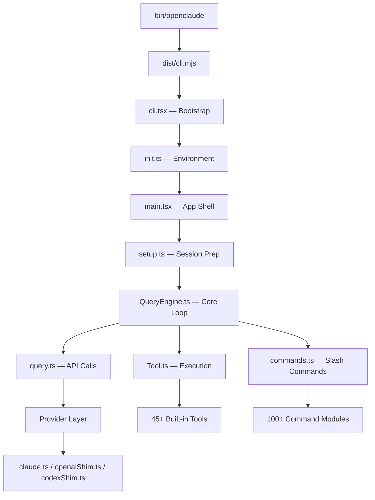

# OpenClaude Architecture

> **Author**: Suryanshu Nabheet · **Version**: 1.0.0 · **License**: MIT

OpenClaude is a terminal-first autonomous coding agent designed for high performance and extensibility. It supports over 200+ LLMs and is built with a modular, tool-centric architecture.

---

## 1. High-Level Architecture

### Core Philosophy
- **Autonomous First**: Designed to solve complex engineering tasks with minimal user intervention.
- **Provider Agnostic**: Seamlessly switch between OpenAI, Gemini, Claude, Ollama, and more.
- **Privacy Centric**: Zero-telemetry by default, local-first data storage.
- **Performance Driven**: Optimized for low latency and high throughput.

---

## 2. Component Breakdown

### 2.1 The Entrypoint
The CLI starts via `bin/openclaude`, which invokes the bundled `dist/cli.mjs`. The bootstrap phase in `cli.tsx` handles environment verification, credential validation, and subcommand routing.

### 2.2 The Query Engine (`QueryEngine.ts`)
The heart of the agent. It manages the state of the conversation, orchestrates tool calls, and handles the "thinking" loop. It is responsible for:
- Session persistence and message history.
- Auto-compaction of long contexts.
- Cost tracking and token budget management.

### 2.3 The Tool System
Tools are modular units of execution. Each tool (e.g., `BashTool`, `FileEditTool`) is isolated and follows a strict protocol for input validation and permission handling.
- **MCP Support**: Full integration with the Model Context Protocol.
- **Safety**: Tools are categorized by risk level, with configurable auto-approval.

### 2.4 The Provider Layer
A unified interface for communicating with diverse LLM APIs.
- **Shims**: Custom shims for OpenAI, Anthropic, and Codex ensure consistent behavior across different models.
- **Routing**: Intelligent model routing based on task complexity and user preferences.

---

## 3. Build & Distribution
Built using **Bun**, OpenClaude compiles into a high-performance ESM bundle.
- **DCE (Dead Code Elimination)**: Build-time feature flags remove unused modules.
- **Self-Contained**: The CLI bundle includes all necessary logic to run as a standalone binary.

---

## 4. Security & Permissions
OpenClaude implements a granular permission system:
- **Allowlists**: Regex-based allow/deny rules for tools (e.g., `git:*`).
- **Interactive Approval**: Users can review and approve tool calls in real-time.
- **Privacy**: No external telemetry or "phoning home".
